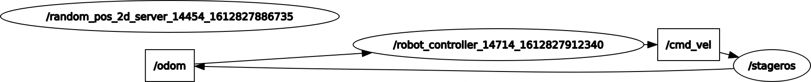

# Research Track I - First Assignment
> The goal of this assignment is controlling a holonomic robot in a 2d space with a 2d simulator, which is called Stage.


In particular the robot controller is fully automatic:
At first it gives a random target to the robot, with both coordinates in the interval (-6.0, 6.0). After that, it controls the robot setting its x and y linear velocity. When the robot reaches the target (distance between the robot and the target is below 0.1), it receives immediately a new one, and so on.

## Implementation

The stage simulation was given and it is implemented in the assignment1 package.
Regarding the controller, we have created a new ROS package called solution_assignment_1, in which there are two python nodes and one service definition.
Starting with the latter one, it is in the srv folder and is called **RandomPos2D.srv**. The request is empty, since there are no parameters that the client has to specify. Instead, the response is formed by two float numbers, regarding the coordinates x and y of the new target.

The server that implements the above service is called **random_pos_2d_server.py**. It is a ROS node with two functions:
The first is service(), where we simply initialize the node and the service. The other one is service_callback(req), and as the name says is the callback function of the service. In particular it extracts two random numbers via the python function random.uniform(), it stores these numbers in the response and sends it to the client.

The other ROS node is called **robot_controller.py**. It implements one publisher to the topic /cmd_vel (where the robot receives the velocity commands), one subscriber to the topic /odom (where the robot publish its position) and a client of the above server. The publisher and the client are created globally at the beginning of the node, because are used in the odom_calback function. The node is formed by two functions:
The first one is control(), in which there is the initialization of the node and the initialization of the subscriber with its callback. The latter is the second function (odom_callback(odometry)) of the node. In the beginning it controls if the target has been reached, performing a subtraction between the target coordinates and the just received robot coordinates, if this condition is true it does a request to the random_pos_2d_server obtaining a new target. After that it calculates the x and y linear velocities, multiplying by a constant k (that we have used equal to 1) the difference between the target and the actual position of the robot, and publishes them to the /cmd_vel topic.

In the following image there is the graph of the architecture:



## Installation

This project is developed and tested with ROS Melodic, it may not work properly with other ROS versions.

Linux:

Copy the two ROS packages (assignment1 and solution_assignment_1) into your ROS workspace and build your workspace with the command catkin_make in the shell.


## Usage example

Linux:

First run the stage simulation:
```sh
rosrun stage_ros stageros $(rospack find assignment1)/world/exercise.world
```

Run the service server node:
```sh
rosrun solution_assignment_1 random_pos_2d_server.py 
```

Run the robot controller node:
```sh
rosrun solution_assignment_1 robot_controller.py 
```


## Meta

Riccardo Parosi – paros97@gmail.com

[https://github.com/Parosi/github-link](https://github.com/Parosi/)


